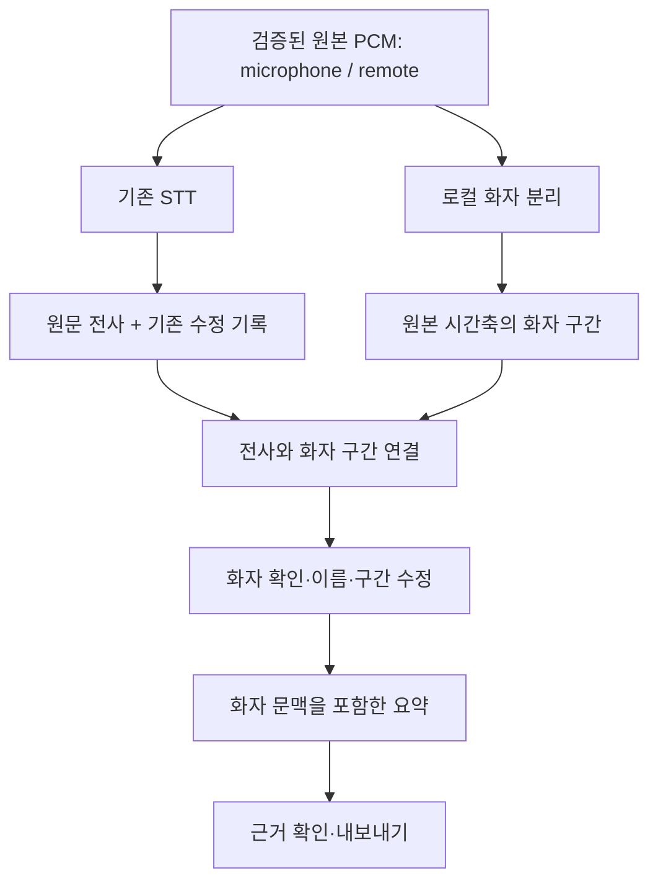

# 다중 화자 구분 구현 계획

작성일: 2026-10-05. 상태: 설계 제안. 이번 변경은 계획 문서이며, 화자 분리 엔진 설치·성능 측정·제품 구현은 아직 수행하지 않았다.

## 목표와 첫 출시 범위

녹음 종료 후 로컬에서 화자를 구분하고, 전사·요약·내보내기에서 발화 주체를 추적한다. 기본 표시는 `화자 1`, `화자 2`이며 사용자가 이름을 연결하거나 잘못 배정된 구간을 수정할 수 있게 한다.

화자 분리(diarization)는 녹음 안에서 같은 목소리에 일관된 익명 ID를 붙이는 기능이다. 실명 식별은 별도 기능이다. [ElevenLabs 개념 설명](https://elevenlabs.io/ko/blog/what-is-speaker-diarization)

- `microphone` / `remote`는 입력 경로다. 한 경로에 여러 사람이 있을 수 있고, 같은 사람이 양쪽에 들어올 수도 있다.
- 첫 버전은 각 입력 경로에서 녹음 전체에 걸쳐 화자를 군집화한다. 트랙 간 동일 인물 연결은 사용자 확인으로 처리한다.
- 짧은 발화·경계·겹침은 불확실성을 표시한다. 모든 문장을 억지로 한 사람에게 배정하지 않는다.
- 실시간 확정, 회의 간 성문 등록·자동 실명 식별, 겹친 음성의 음원 분리는 후속 범위다. 화자 분리만으로 겹친 두 사람의 발언을 모두 전사할 수 있다고 보장하지 않는다.
- 확장 지점은 정규화된 화자 결과와 실행 함수 하나로 제한한다. 최초 채택 엔진은 하나이며, 범용 플러그인 프레임워크나 여러 엔진의 자동 대체 실행은 만들지 않는다.

## 현재 코드에서 확인한 제약

| 위치 | 현재 동작 | 설계에 반영할 점 |
|---|---|---|
| `src/contracts.mts`, `src/transcript.mts` | 입력 경로, 시간, 전사·인용을 검증 | source를 사람으로 해석하지 않는다. 전사 ID와 원문은 보존한다. |
| `src/stt-settings.mts` | 30초 전사 창, 2초 겹침 | 창마다 화자 번호를 새로 부여하면 안 된다. 화자 분석은 전사 창과 독립적으로 실행한다. |
| `src/transcript.mts` | 전사 충돌·누락·미확인 음성이 있으면 자동 요약 차단 | 화자 정보로 이 검토 조건을 우회하지 않는다. |
| `src/corrections.mts` | 전사 내용 해시와 revision으로 수정 기록 연결 | 화자 필드를 전사 객체에 직접 넣어 기존 수정 기록을 무효화하지 않는다. |
| `src/jobs.mts` | 작업 캐시, 결과 검증, 취소, 원자적 저장 | `diarize` 작업 종류를 추가해 재사용한다. 장시간 결과는 현재 2 MiB 제한을 측정한다. |
| `src/electron/installed-models.mts` | stt/summary/vad만 허용, 모델 파일 검증 | 선택적 diarization 모델 팩과 실제 런타임 자산 허용 목록을 추가한다. |
| `src/inference/worker.mts` | 단일 모델·작업 경로 | 새 엔진을 기존 summary 분기로 흘려보내지 않는다. 무거운 분석은 UI/Main 이벤트 루프 밖에서 실행한다. |
| `src/transcript.mts`, `src/inference/summary.mts` | 요약 입력에는 ID와 원문만 전달 | 화자 문맥을 별도 전달하고 기존 짧은 인용 ID 매핑을 유지한다. |
| `src/reviews.mts`, `src/export.mts` | 전사와 요약으로 검토 키 생성·내보내기 검증 | 화자 변경 후 오래된 요약과 승인 상태가 재사용되지 않도록 입력 지문을 연결한다. |

이전 가짜 마이크 검증은 한 명의 합성 음성과 30초 미만 전사 창에 대한 성공 사례다. 다중 화자 정확도는 아직 검증하지 않았다. 긴 녹음에서 발견한 전사 창 경계 충돌은 별도 선행 과제로 유지한다. [기존 검증 기록](../RELEASING.md#review-follow-up-from-the-fake-microphone-run-2026-10-05)

## 처리 구조

화자 분석은 녹음 단위 작업이지만 전체 PCM을 여러 번 메모리에 복제할 필요는 없다. 엔진 입력 블록과 원본 프레임의 매핑을 보존하고, 최종 군집화는 같은 입력 경로의 전체 녹음을 대상으로 한다. 초기 실행은 STT → 화자 분석 → 요약 순서로 직렬화해 모델 메모리 경합을 줄인다.

STT용 VAD 결과로 잘린 음성만 화자 엔진에 강제 입력하지 않는다. 엔진이 요구하는 원본 구간과 자체 segmentation을 사용하되, 일시정지·누락 경계는 명시적으로 처리한다. 잘라 붙인 입력을 사용할 때는 원본 시간축으로 복원하는 매핑을 필수로 둔다.

## 엔진 선택: 짧은 비교 실험 후 하나 확정

| 후보 | 검토 이유 | 채택 전에 확인할 항목 |
|---|---|---|
| sherpa-onnx | 공식 화자 분리 문서에 JS WASM 및 Node addon 예제가 있어 현재 JS/Electron 구조와의 통합을 먼저 평가하기 좋다. | 한국어 음성 정확도, 선택 모델의 중첩 지원, Electron ABI/패키징, Windows/macOS 실행, 모델별 라이선스·배포 조건, 메모리·속도 |
| pyannote community-1 | 로컬 전체 파일 분석과 오프라인 모델 로딩을 제공하므로 품질 비교 기준으로 사용한다. | Python/PyTorch 배포 비용, 모델 접근 조건, 대상 장치 CPU/GPU 성능, 하위 모델 의존성 |

sherpa의 WASM 패키지는 문서상 멀티스레딩을 지원하지 않고 Node addon은 지원한다. 문서의 JS 지원만으로 기존 브라우저 Worker에 바로 연결할 수 있다고 단정하지 않는다. 우선 독립 실행 실험에서 동작과 패키징을 확인한다. [공식 JS API 설명](https://k2-fsa.github.io/sherpa/onnx/speaker-diarization/javascript.html)

pyannote는 Python/PyTorch 기반이며, community-1은 로컬 모델 디렉터리에서 오프라인 실행할 수 있다. 제품에 사용하면 모델 준비 과정과 런타임을 분리하고 텔레메트리도 비활성화한다. 한국어 품질과 이 앱의 대상 PC 속도는 직접 측정해야 한다. [공식 저장소](https://github.com/pyannote/pyannote-audio), [community-1 모델 카드](https://huggingface.co/pyannote/speaker-diarization-community-1)

권장 순서는 sherpa 통합 가능성 확인 → 동일 코퍼스의 pyannote 품질 비교 → 단일 엔진 확정이다. 첫 후보가 품질 기준을 충족하지 못하면 배포 비용을 포함해 재선정한다. ElevenLabs 링크는 개념 참고이며 클라우드 음성 전송을 도입하는 결정은 아니다.

## 데이터와 수정 정책

제품에 저장할 최소 구조는 다음과 같다. 실제 필드명과 버전은 첫 계약 구현에서 고정한다.

| 객체 | 필수 내용 |
|---|---|
| 화자 분석 결과 | version, sessionId, 오디오 입력 해시, 모델·설정 해시, 결과 해시, 화자 목록, 발화 구간 |
| 발화 구간 | turnId, source, epoch, sampleRate, startFrame, endFrame, speakerIds, 상태 |
| 전사 연결 | segmentId, 연결된 turnId 목록, `single` / `mixed` / `unknown` 판정 |
| 사용자 수정 | 기반 결과 해시, revision, 구간 화자 재배정, 화자 이름·병합 기록 |

- 원본 source/epoch/sampleRate의 정수 프레임을 기준으로 하고 구간은 `[startFrame, endFrame)`로 정의한다. 리샘플링·일시정지 후에도 원본 재생 위치와 일치해야 한다.
- 순차적으로 화자가 바뀌는 전사 구간은 `mixed`, 실제 동시 발화는 별도 overlap 상태로 구분한다. 모르는 화자는 빈 speakerIds와 명시적 unknown으로 표현한다. 엔진이 중첩을 지원하지 않으면 지원하지 않는다는 능력 정보를 보존한다.
- 화자 ID는 녹음 안에서 유일하게 만들고 source와 분리해 참조한다. 같은 source의 A → B → A는 같은 화자로 유지한다. 초기 자동 군집은 source 간에 병합하지 않는다.
- 재분석 결과의 `speaker_0`을 이전 결과의 `speaker_0`과 같은 사람으로 가정하지 않는다. 사용자 수정은 기반 결과 해시에 묶고, 새 결과에는 확인 없이 이식하지 않는다.
- 전사 문장 대부분을 차지했다는 이유만으로 다른 사람이 말한 짧은 부분까지 귀속시키지 않는다. 보수적 경계 기준으로 안전한 단일 화자만 연결하고 나머지는 mixed/unknown으로 둔다. 기준은 검증 코퍼스에서 고정한다.
- 초기에는 전사 원문을 화자 경계에 맞춰 재작성하지 않는다. 정확한 단어 시간 정렬이 도입된 경우에만 단어별 배정을 추가한다. 글자 수 비례 분할로 가짜 정밀도를 만들지 않는다.
- 엔진이 제공하지 않는 confidence를 임의 확률로 만들지 않는다. 음성 임베딩은 기본적으로 영구 저장하지 않는다.
- 기존 기록에 화자 결과가 없으면 현재 전사·요약 동작을 유지한다. 손상된 화자 결과는 성공으로 간주하지 않고 오류와 재분석 경로를 제공한다.

화자 수정 저장은 기존 전사 수정 저장과 분리한다. 화자·이름 수정은 STT 캐시를 무효화하지 않지만 요약에 쓰이는 문맥을 바꾸므로 요약·분할·통합 요약의 입력 해시와 검토 키를 변경한다. UI 색상 등 표현만 바뀌면 재요약하지 않는다. 진행 중 수정되면 이전 문맥으로 생성된 결과를 최신 결과로 게시하지 않는다.

## 요약과 사용자 경험

1. 분석 상태를 전사 / 화자 분석 / 요약으로 표시한다. 화자 분석이 실패해도 원문은 보존하고 재시도 또는 화자 없이 요약하기를 제공한다. 실패를 숨기고 화자 분석 완료로 표시하지 않는다.
2. 전사에 `마이크 · 화자 1`처럼 입력 경로와 사람을 함께 표시한다. 발화 구간 재생, 이름 지정, 구간 재배정, 같은 사람 병합, 수정 취소를 지원한다.
3. 요약 입력에 원문과 별개로 화자 ID, 확인된 이름, 연결 상태를 넣는다. 사용자 이름도 지시문이 아닌 데이터로 취급한다.
4. “제가 보고서를 만들겠습니다”는 연결된 화자가 확실한 경우에만 해당 화자의 작업으로 요약한다. 이름을 확인하지 않았으면 익명 화자를 사용한다. mixed/unknown이면 담당자 미확정으로 남긴다.
5. “민수가 보고서를 만들겠습니다”에서 민수는 언급된 담당자다. 발화자의 이름으로 바꾸지 않는다. 사람 이름이 원문에 등장했다는 이유만으로 화자 실명을 자동 지정하지 않는다.
6. 기존 summary v1의 `segmentId + exact quote` 계약은 유지한다. 화자 문맥 해시와 인용 구간의 화자 연결은 분석 결과에 별도 보존한다. 인용 일치 검사만으로 담당자 의미가 맞는다고 간주하지 않는다.
7. 전사뿐 아니라 부분 요약·통합 요약·내보내기까지 같은 화자 문맥을 사용한다. 오래된 문맥의 요약과 승인 상태는 최신으로 내보낼 수 없게 한다. 구조화된 담당자 필드가 필요해지는 후속 버전에서 명시적인 summary 스키마 버전 변경을 한다.

## 검증 코퍼스와 판정

기존 `beta-launch` 시나리오를 확장한다. 주제와 사실 기대값을 음성 생성 전에 고정하고 서로 다른 실제 TTS voice로 A/B/C 발화를 만든다. 같은 음성의 피치·속도 변경만으로 다중 화자 코퍼스를 대체하지 않는다. TTS는 WAV 준비에 사용하고 제품 경로는 녹음 → STT → 화자 분리 → 요약이다.

| 케이스 | 대화 구성·기대 결과 |
|---|---|
| 기본 A-B-A | A가 베타 11월 11일과 예산 미승인·보류를 말하고, B가 “제가 오류 수정 보고서를 11월 8일까지”라고 말함. 뒤에 돌아온 A의 ID 유지, 보고서는 B에게 귀속 |
| 세 명 + 실명 연결 | C가 “사용자 안내문은 제가 11월 9일까지”라고 말함. B=지현, C=민수를 사용자 매핑으로 지정하면 원래 5개 사실과 두 담당자·기한을 정확히 요약 |
| 이름 언급 대조 | A가 “민수가 안내문을 작성합니다”라고 말함. A를 민수로 변경하지 않고 담당자만 민수로 유지 |
| 경계·긴 녹음 | 28~32초 부근 교대, 정상 속도 1~3분 대화, 긴 침묵 후 A 재등장. 30초 미만으로 줄여 통과시키지 않음 |
| 실제 겹침 | 별도 음성을 같은 시간에 믹싱. overlap 표시와 불확실한 담당자 확정 방지. 두 발언 모두 STT 성공은 별도 측정 |
| 입력 경로·잡음 | microphone와 remote 각각 복수 화자, 양쪽으로 들어온 같은 목소리, 짧은 “네”, 소음, pause/resume. 임의 트랙 간 병합·시간 이동 방지 |
| 수정·재실행 | 이름/배정 수정 후 STT 재실행 없이 요약 갱신, 기존 승인 무효화. 취소·재시작·모델 변경 시 오래된 결과 게시 방지 |

평가는 단계별로 분리한다.

- **음향 화자 정확도:** 수동 확인한 정답 발화 시간과 화자 라벨로 DER/JER, 화자 수, A 재등장 일관성을 계산한다. 라벨 숫자는 임의이므로 최적 대응 후 비교한다. 평가 구간, 경계 허용 폭(collar), 중첩 포함 여부를 고정한다. 주 점수는 collar 0·중첩 포함, 보조 점수는 250ms collar·비중첩 구간으로 기록한다. [DER/JER 개념](https://elevenlabs.io/ko/blog/what-is-speaker-diarization)
- **전사와 정렬:** 원문 사실 보존, 전사 구간과 화자 연결 오류, mixed/unknown 비율, 원본 오디오 위치를 검사한다. 엔진 결과가 좋아도 문장 단위 정렬에서 틀리는 경우를 별도 집계한다.
- **요약 의미:** 기존 LLM judge에 담당자 교환, 발화자/언급 인물 혼동, 1인칭 오귀속, 불명 화자 실명 날조, 예산 부정 반전, 기한 혼합의 실패 대조군을 추가한다. 정확한 인용 검사는 그대로 유지한다. 음향 화자 동일성은 텍스트 LLM judge에 맡기지 않는다.
- **실행 경로:** 빠른 단위 테스트 → 실제 엔진 오프라인 통합 테스트 → fake-mic 녹음 E2E로 분리한다. 실제 두 입력 경로 검증은 기존 silent remote 대역을 실제 테스트 PCM 입력으로 확장해야 하며, fake microphone 플래그 하나로 시스템 오디오까지 검증됐다고 주장하지 않는다.
- **재현성:** WAV·정답·모델·설정·judge 버전과 해시, 오류 단계, 처리 시간, 메모리 최대값을 결과에 남긴다. 실패 실행도 보존한다. 합성 음성 외에 동의받은 한국어 실제 다중 화자 녹음을 별도 평가한다.

초기 제안 게이트: 깨끗한 비중첩 코퍼스의 화자 수와 A-B-A 대응 전부 일치, 필수 사실·담당자 오류 0건, 모든 judge 대조군의 기대 판정 일치, 기준 PC에서 10분 입력의 RTF(처리 시간/음성 길이) ≤ 1.0. DER/JER·메모리 상한과 잡음/중첩 허용치는 1단계 측정 후 숫자로 고정하고, 최종 검증용 음성은 튜닝에 사용하지 않는다. 같은 고정 E2E를 3회 실행해 모두 통과해야 초기 게이트를 통과한 것으로 본다. 이는 제품 전체 정확도 추정치는 아니다.

## 실행 순서와 완료 조건

| 순서 | 작업 | 완료 조건 |
|---|---|---|
| 1. 가능성·선행 문제 확인 | 다중 음성 WAV/정답 제작, 엔진 2개 비교, 긴 전사 창 충돌 재현 | 대상 OS별 실행·패키징 근거, 품질·시간·메모리 보고서, 단일 엔진 결정, 수치 게이트 확정. 충돌은 원문 보존하며 해결하거나 명시적 검토 경로를 확정 |
| 2. 데이터·엔진 연결 | `diarization.mts`에 결과 검증·전사 연결, jobs 종류 및 선택적 모델 설치 확장, 실제 실행 모듈 하나 추가 | 시간·source·epoch·모델 해시 검증, 취소·재시작, 네트워크 차단 상태 실제 엔진 실행, 기존 기록 호환 |
| 3. 화자 수정·표시 | 화자 수정 저장, 분석 결과/IPC/UI/내보내기에 연결 | 구간 재생·이름·배정·병합 수정, 원문·인용 ID 불변, 수정 충돌과 재분석 처리 검증 |
| 4. 요약 통합 | `summaryInput`, 프롬프트, 분할·통합 입력, 리뷰 키에 화자 문맥 반영 | 1인칭·실명 언급 대조군, 문맥 변경 시 요약/검토 무효화, 오래된 결과 차단 |
| 5. 회귀·출시 확인 | 기존 fake-mic-summary/judge 확장, 다중 소스·장시간·실제 음성 평가 | 기존 회귀 통과, 새 수치 게이트 통과, 미지원/겹침/실패 UX 확인, OS별 패키지 확인 |

2단계의 엔진 실행 위치는 1단계 결과로 결정한다. Node addon이면 별도 실행 프로세스로 격리하고, WASM이면 호환성이 확인된 Worker에서 실행한다. Python을 채택하면 기존 Apple STT의 helper 통신 패턴을 참고하되, 실행 경로·메시지 크기·timeout·취소 검증을 갖춘 별도 helper로 둔다. 모든 엔진을 동시에 제품에 넣지는 않는다.

첫 구현 착수점은 **1단계 코퍼스와 엔진 비교 실험**이다. 현재 단일 화자 E2E의 성공을 다중 화자 품질 보증으로 확대하지 않고, 측정 결과를 기준으로 제품 의존성을 결정한다.
